# 🧠 MindMate

A Java Swing desktop application designed to support mental well-being through mood tracking, habit management, wellness activities, chatbot support, and data-driven insights.

Developed as an Object-Oriented Programming (OOP) Capstone Project at UPES.

---

## ✨ Features

### 👤 User Features
- Secure Login & Registration
- Daily Mood Tracking
- Habit Tracker
- Wellness Activities
- Integrated Chatbot
- Therapist Support
- Personal Dashboard

### 👨‍💼 Admin Features
- Admin Dashboard
- User Activity Monitoring
- Analytics Dashboard
- Message Management
- User Logs

---

## 🛠 Tech Stack

- Java
- Java Swing
- SQLite
- JDBC
- Object-Oriented Programming (OOP)

---

## 📸 Screenshots

### Login
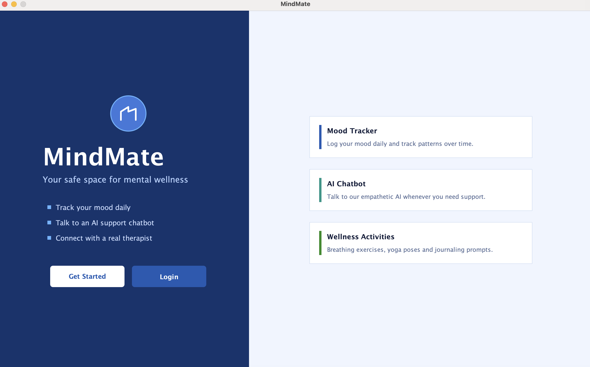

### Home Dashboard
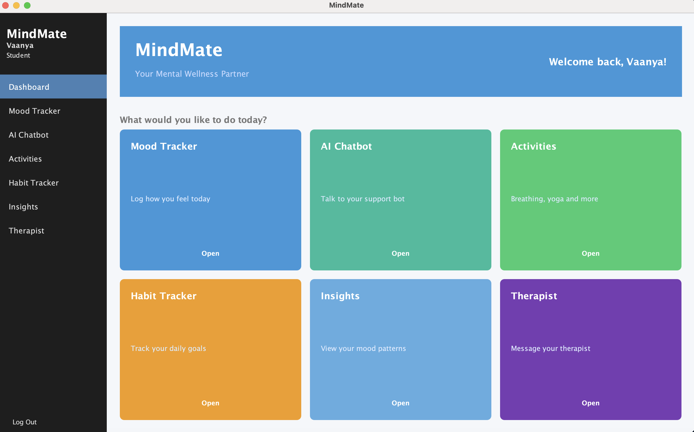

### Mood Tracker
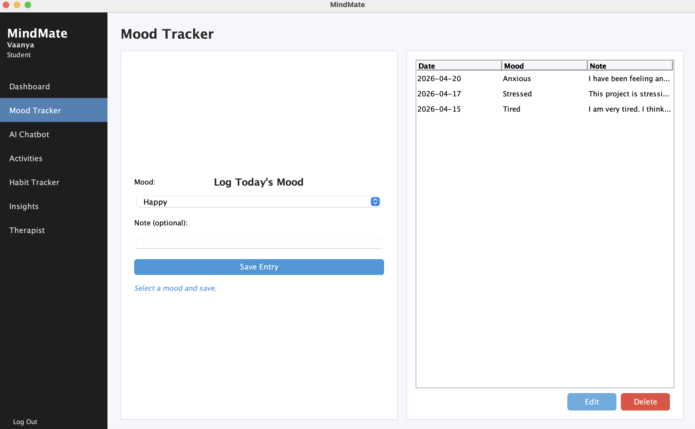

### Habit Tracker
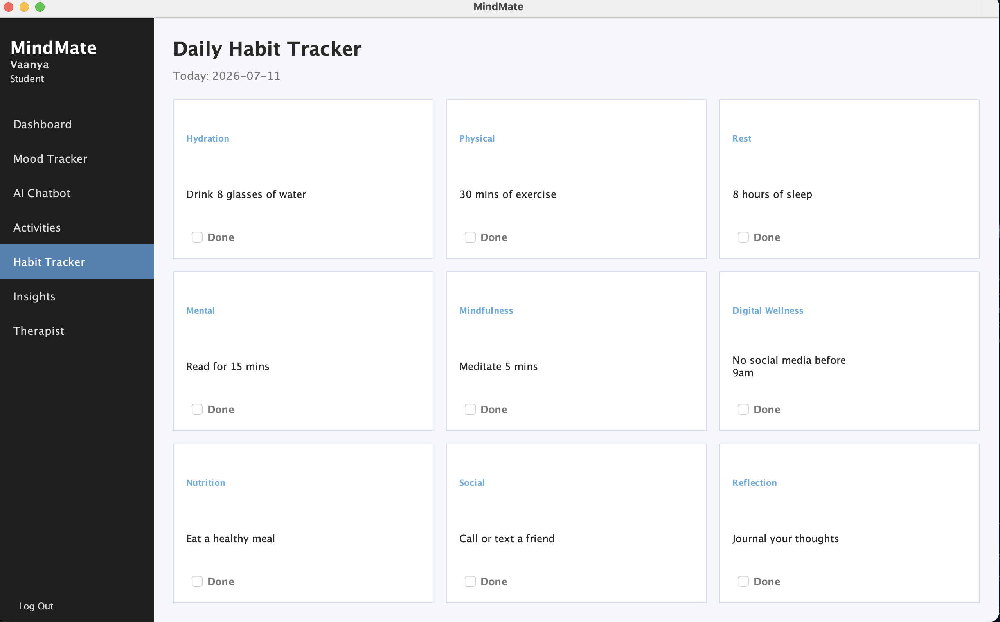

### Activities
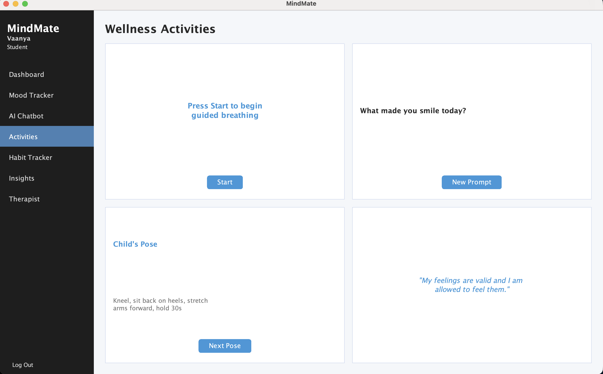

### Chatbot
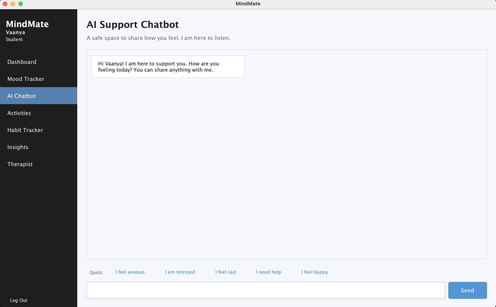

### Insights Dashboard
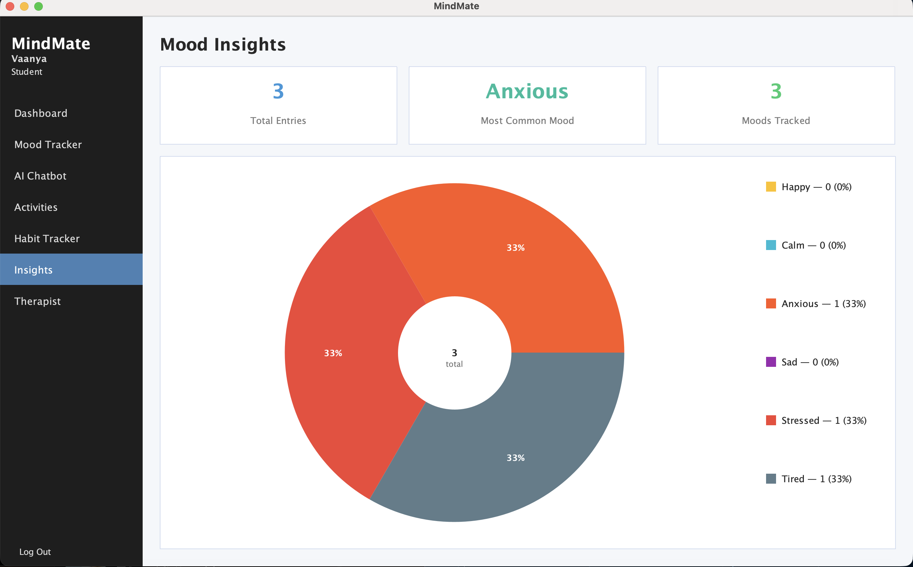

### Admin Dashboard
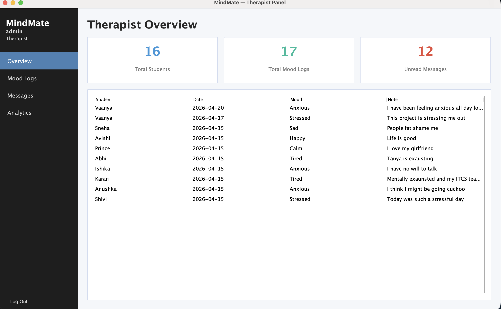

### Admin Analytics
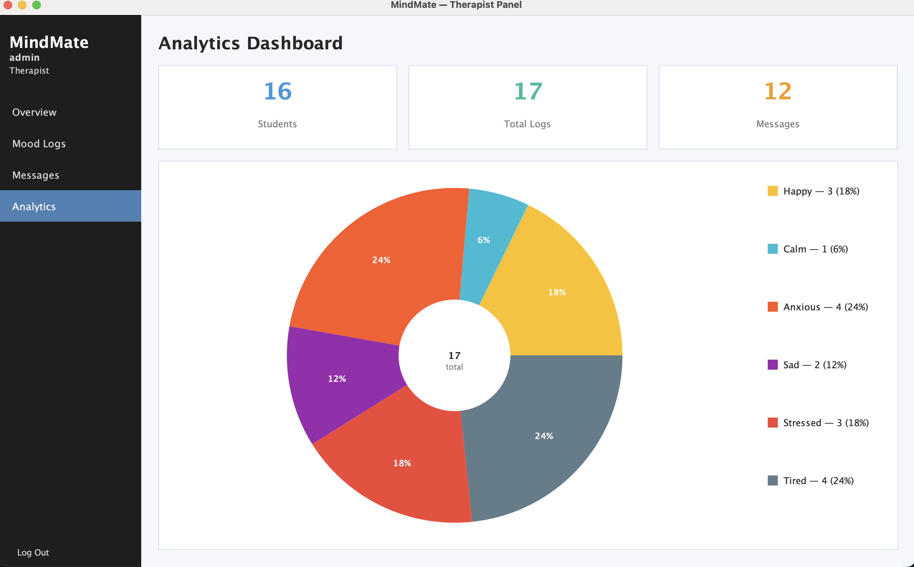

### Admin Messages
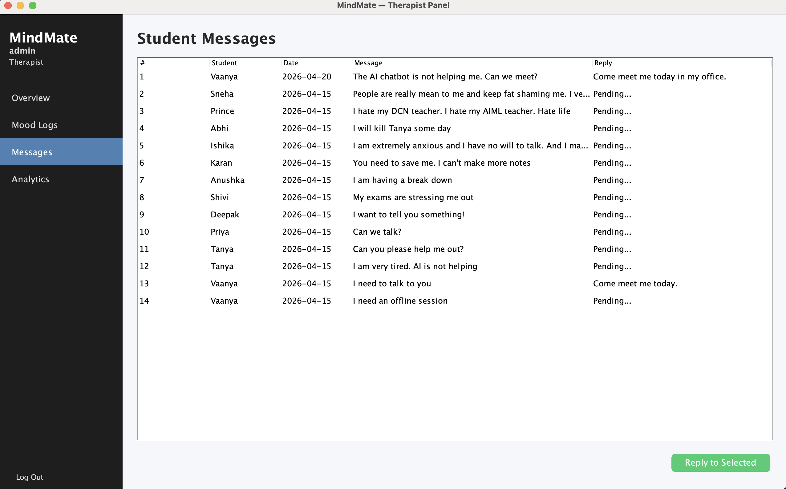

### User Logs
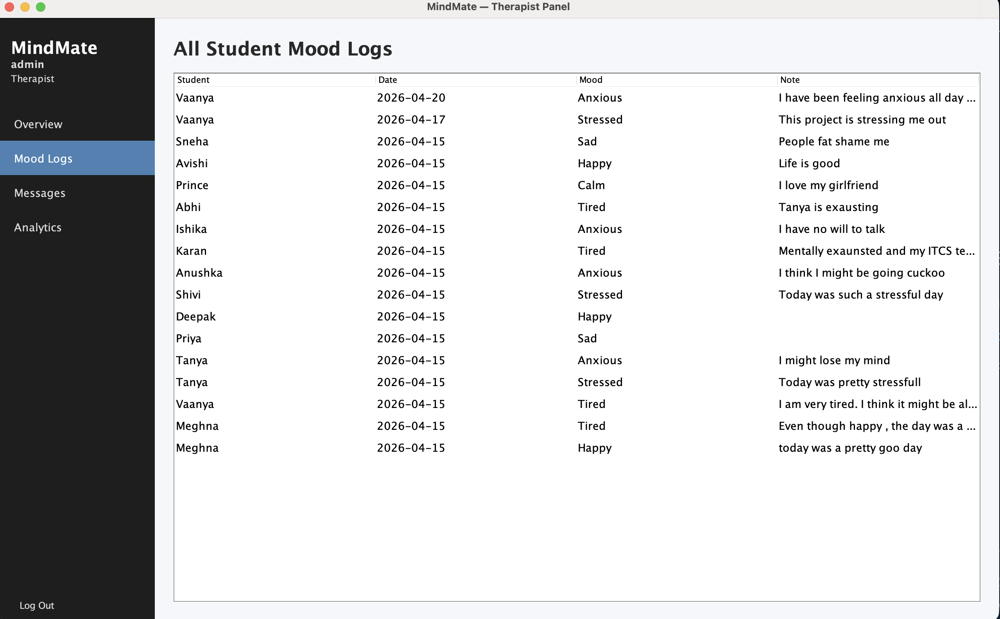

### Therapist Support
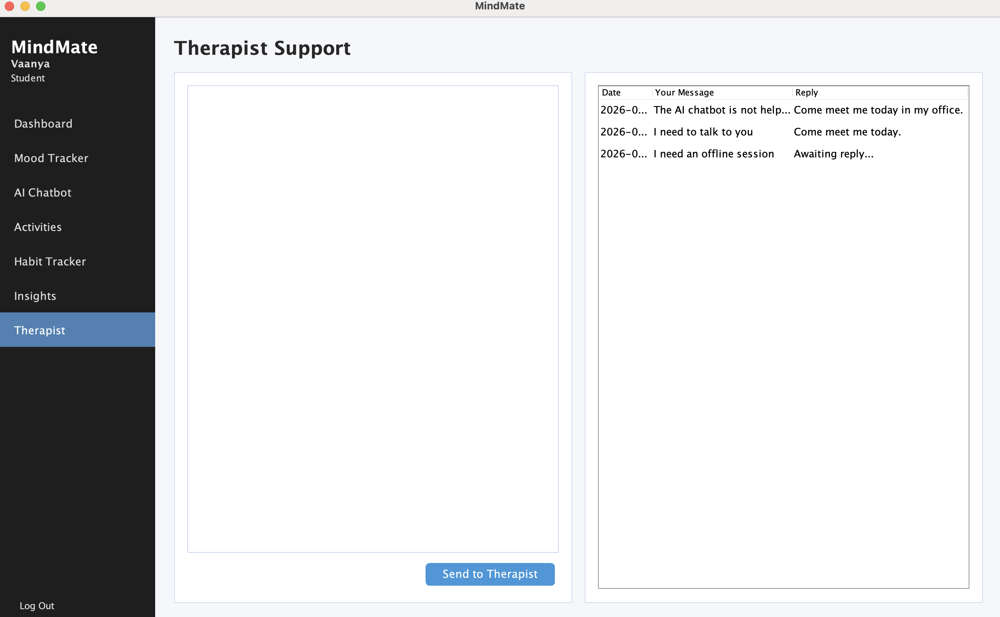

---

## 🚀 Getting Started

### Requirements

- Java JDK 17 or later
- SQLite JDBC Driver

### Clone the repository

```bash
git clone https://github.com/YOUR_USERNAME/MindMate.git
```

### Run

Open the project in VS Code or IntelliJ IDEA and run:

```
Main.java
```

---

## 📂 Project Structure

```
MindMate/
├── src/
├── lib/
├── screenshots/
├── mindmate.db
├── README.md
├── LICENSE
└── .gitignore
```

---

## 🌱 Future Improvements

- Password hashing and enhanced authentication
- AI-powered mental wellness assistant
- Cloud database integration
- Email reminders and notifications
- Mobile companion application
- Appointment scheduling with therapists

---

## 📄 License

This project is licensed under the MIT License.